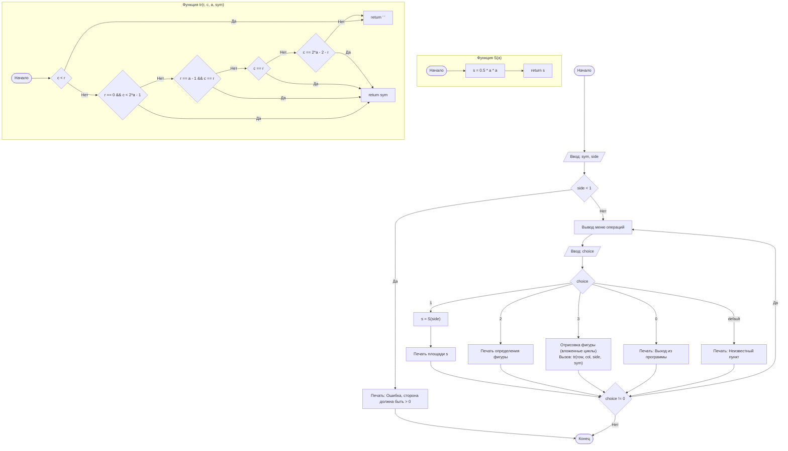

```mermaid
graph TD
    Start([Начало]) --> InputData[/Ввод: sym, side/]
    
    InputData --> CheckSide{"side < 1"}
    CheckSide -->|Да| Error["Печать: Ошибка, сторона должна быть > 0"]
    Error --> End([Конец])

    CheckSide -->|Нет| Menu["Вывод меню операций"]
    Menu --> InputChoice[/Ввод: choice/]
    
    InputChoice --> Switch{"choice"}

    Switch -->|1| Case1["s = S(side)"]
    Case1 --> PrintS["Печать площади s"]
    PrintS --> LoopCond

    Switch -->|2| Case2["Печать определения фигуры"]
    Case2 --> LoopCond

    Switch -->|3| Case3["Отрисовка фигуры (вложенные циклы)
    Вызов: tr(row, col, side, sym)"]
    Case3 --> LoopCond
    
    Switch -->|0| Case0["Печать: Выход из программы"]
    Case0 --> LoopCond
    
    Switch -->|default| CaseDef["Печать: Неизвестный пункт"]
    CaseDef --> LoopCond

    LoopCond{"choice != 0"}
    LoopCond -->|Да| Menu
    LoopCond -->|Нет| End

    subgraph "Функция S(a)"
        F1_Start([Начало]) --> F1_Calc["s = 0.5 * a * a"]
        F1_Calc --> F1_Ret["return s"]
    end

    subgraph "Функция tr(r, c, a, sym)"
        F2_Start([Начало]) --> F2_Cond1{"c < r"}
        F2_Cond1 -->|Да| F2_RetSpace[return ' ']
        
        F2_Cond1 -->|Нет| F2_Cond2{"r == 0 && c < 2*a - 1"}
        F2_Cond2 -->|Да| F2_RetSym[return sym]
        
        F2_Cond2 -->|Нет| F2_Cond3{"r == a - 1 && c == r"}
        F2_Cond3 -->|Да| F2_RetSym
        
        F2_Cond3 -->|Нет| F2_Cond4{"c == r"}
        F2_Cond4 -->|Да| F2_RetSym
        
        F2_Cond4 -->|Нет| F2_Cond5{"c == 2*a - 2 - r"}
        F2_Cond5 -->|Да| F2_RetSym
        
        F2_Cond5 -->|Нет| F2_RetSpace
    end
```
